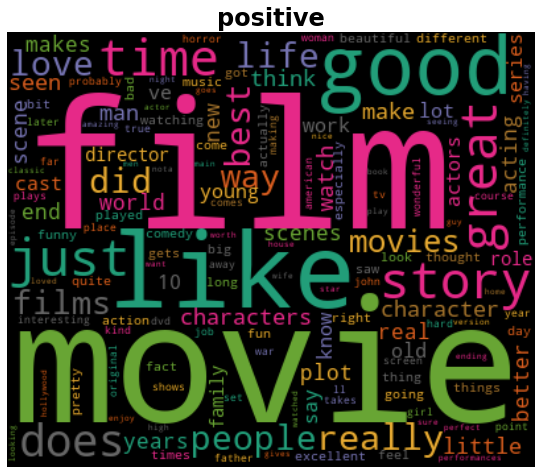
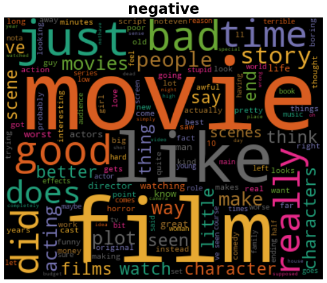
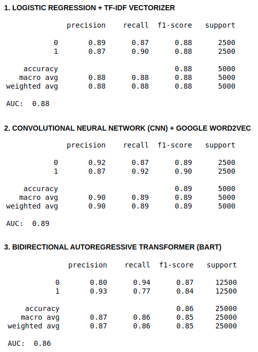

#  CAPSTONE: SENTIMENT ANALYSIS
***BY: KEVIN LUU***

[WEB APP DEMO](https://share.streamlit.io/l-kevin/sentiment_analysis/main/webapp/main_app.py)

## EXECUTIVE SUMMARY

### PROBLEM STATEMENT
As humans, we express our thoughts and feelings about any situation in our everyday life. It could be about the beautiful weather, your repetitive work life, that bland sandwich... anything really. One large avenue of sentiments would be reviews. As a regular at Amazon, I'm always looking through reviews to ensure I feel good about my purchases. However, there have been some instances where I didn't get good products despite my efforts.

An example would be when I purchased a plant-based rice that comes in a bag, but instead I received disgusting bag of mush...
Another instance would be during the holidays where I purchased a monitor only to return it due to it coming with lines of dead pixels  on the side.

Taking a deeper dive at reviews, there were definitely other users with similar experiences. This makes me wonder... why are these situations reoccurring? Shouldn't there be corrective action towards the negative reviews. Has quality control not improved due to these negative experiences? Won't improving the experience minimize returns and increase profit for everyone?

Since these questions could not be answers, the goal is to find a way to answer them or become the person that can deliver the solution through this sentiment-analysis project.

1. **I need a model that can predict the sentiment (positive/negative/neutral) of reviews at a 90-95% accuracy rate along with a 90% or higher area-under-ROC as predicting all classes are important.**
2. **Given that model, can it be generalized towards other types of reviews from any corporations that deliver products & services?**

### DATA
- Sourced from [Stanford University](http://ai.stanford.edu/~amaas/data/sentiment/) -- collected of IMDB reviews
- Training dataset consists of 25000 labeled reviews
  - 12500 negative reviews (<= 4 ratings)
  - 12500 positive reviews ()>=7 ratings )
- Unsupervised (unlabeled) dataset of 50000 reviews
  - inclusive of between 4-7 ratings
- Originally in the form of 75000 .txt files:
  - compiled into MS Excel Queries --> transformed & exported as UTF-8 .csv file

### METHODOLOGY
- Data Wrangling
    - data manipulation to comma-separated-values
    - review text cleaning
      - (lowercase, removal of URL elements, retained letters only)
- Experimental Data Analysis (EDA)
    - NLP count vectorization for most frequent words per sentiment
      - horizontal bar chart
      - word cloud
    - character and word count distributions
    - word2vec - top 30 similar words to bad/good
- Modeling Training & Implementation
    - 3 models
      - Logistic Regression (LogReg)
        - TF-IDF Vectorizer
      - Convolutional Neural Network (CNN)
      - Bidirectional Autoregressive Tranformer (BART)
        - Pre-trained models:
          - (local) [FaceBook's bart-large-mnli](https://huggingface.co/facebook/bart-large-mnli)
          - (web-app server) [Valhalla's distilbart-mnli-12-3](https://huggingface.co/valhalla/distilbart-mnli-12-3)
            - reduced version of FaceBook's bart-large-mnli model that the StreamLit server can handle

**Data Dictionary:**
|Feature|Dataset|Description|
|:---|:---|:---|
|positive|all variations of "train.csv"|The sentiment classification of the movie review (1 = positive, 0 = negative)|
|text|all variations of "train.csv"|Individual movie reviews some IMBD|

**EDA:**
 Using Count Vectorization on the consolidated reviews,here's a visual look at the top 30 words from each sentiment:

**Modeling:**
1. For the conventional models, the best model for training was selected based on the 5-fold cross validation scores all 14 combinations of 7 models + 2 vectorizers (Count and TF-IDF):
  - **Logistic Regression** (highest accuracy & roc_auc)
  - KNN
  - BernoulliNB
  - MultinomialNB
  - Random Forest
  - AdaBoost
  - XGBoost
2. Through trial and error while considering computational & memory efficiency, a CNN model was developed to attain stronger metrics than the non-neural models
3. To confirm effectiveness, a pre-trained transformer neural network called BART (bidirectional autoregressive transformer) was also used.

**Evaluation Results:**

### WEB-APPLICATION DEVELOPMENT
- The purpose of the web application is to allow users to be able to input their review in order to receive insightful information on the next steps to take based on the analyzed review.
- The target audience would be corporations with product & services that are looking to understand their clients & improve their business.
- The application will come with 2 pages:
  1. A simple analyzer where the user input a single review and have simple sentiment-based information displayed:
    - type of the sentiment the review exhibits
    - consulting suggestion based on sentiment
  2. A complex analyzer where the user can input a collection of reviews for analysis and have a dashboard full of sentiment-based information:
    - ratio of sentiments across all reviews
    - table of all reviews and their labeled sentiment with color-mapping
    - character & word count distribution (most common amounts as well as average amounts)
    - *not incorporated, but intended:*
      - sentiment over time line chart
      - word cloud
      - common words bar chart

### CONCLUSION
After testing various reviews, we can conclude that:
1. The models can predict sentiment very well.
2. However, the models are limited to performing well with lengthy movie reviews with either a positive or negative sentiment.
3. Therefore, the model and web-application is not currently ready for generalization towards other types of products & services reviews.

### FUTURE CONSIDERATIONS
1. **Dashboard improvements** -- the current dashboard on the web-application could use more visuals:
  - **sentiment over time** analysis (improving the model to analyze time)
  - feature extraction -- extracting the **most common words** from positive or negative sentiments to display as a bar character
  - sentence extraction -- allowing the user to input their product/service name & type so that **the exact sentence/opinion about their product can be displayed** instead of having them read through the reviews
  - displaying information about competitor reviews
2. Using **other data types and data-sets** -- to tackle the current limitations of the model:
  - analyzing speech-to-text data from companies that use call-centre channels as their means of delivering product & services
    - predicting client sentiment can benefit toward understanding churn behaviour as well as dissecting best practices (or worst practices) in positive/negative rep-to-client conversations
    - training on more diverse amounts of product reviews to allows that model to develop a better understanding of predicting sentiment
      - may including a large collection of neutral sentiments may help
3. Conducting other types of sentiment analysis:
  - emotion-based (ie. happy/sad/angry/confused)
  - grade-based (ie. 1-5 stars/levels)
