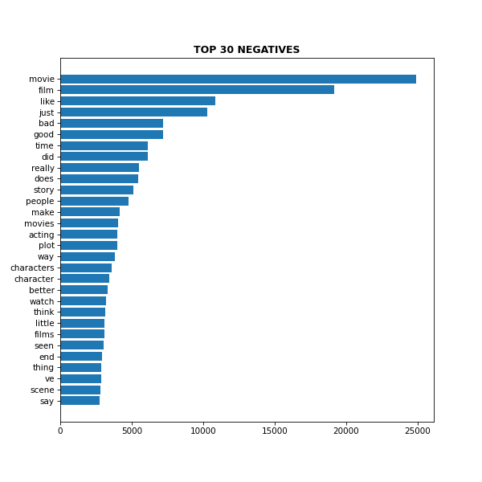

#  CAPSTONE: SENTIMENT ANALYSIS
***BY: KEVIN LUU***

[WEB APP DEMO](https://share.streamlit.io/l-kevin/sentiment_analysis/main/webapp/main_app.py)

## EXECUTIVE SUMMARY

### PROBLEM STATEMENT
Dread calling into customer service to fix your issue....
What are these big corps doing?

Are there common trends?
Can it be generalized?

*Citations:*
 1 - https://www.theglobeandmail.com/life/article-why-the-pandemic-videogame-boom-is-great-for-canada/
 2 - https://www.washingtonpost.com/video-games/2020/05/12/video-game-industry-coronavirus/
 3 - https://www.theverge.com/2020/5/13/21257227/coronavirus-streamelements-arsenalgg-twitch-youtube-livestream-numbers

### DATA
- Sourced from [Stanford University](http://ai.stanford.edu/~amaas/data/sentiment/) -- collected of IMDB reviews
- Training dataset consists of 25000 labeled reviews
  - 12500 negative reviews (<= 4 ratings)
  - 12500 positive reviews ()>=7 ratings )
- Unsupervised (unlabeled) dataset of 50000 reviews
  - inclusive of between 4-7 ratings
- Originally in the form of 75000 .txt files:
  - compiled into MS Excel Queries --> transformed & exported as UTF-8 .csv file

### METHODOLOGY
- Data Wrangling
    - data manipulation to comma-separated-values
    - review text cleaning
      - (lowercase, removal of URL elements, retained letters only)
- Experimental Data Analysis (EDA)
    - NLP count vectorization for most frequent words per sentiment
      - horizontal bar chart
      - word cloud
    - character and word count distributions
    - word2vec - top 30 similar words to bad/good
- Modeling Training & Implementation
    - 3 models
      - Logistic Regression (LogReg)
        - TF-IDF Vectorizer
      - Convolutional Neural Network (CNN)
      - Bidirectional Autoregressive Tranformer (BART)
        - Pre-trained models:
          - (local) [FaceBook's bart-large-mnli](https://huggingface.co/facebook/bart-large-mnli)
          - (web-app server) [Valhalla's distilbart-mnli-12-3](https://huggingface.co/valhalla/distilbart-mnli-12-3)
            - reduced version of FaceBook's bart-large-mnli model that the StreamLit server can handle

**Data Wrangling:**
 The feature 'selftext' was the only one that had missing values. This was due to the post being an image-only post without any text. Removing these posts was not the option as the title of the posts still contained useful information. Therefore, all null posts along with all posts that only had "[deleted]" or "[removed]" were filled with a blank space.
 Since the title also contained useful information, a new column called 'text' was created as a combination and replacement of the 'title' and 'selftext' features
 The 'subreddit' feature contained 'pcgaming' or 'console' -- therefore, was handled with label-encoding:
- pcgaming = 1
- console = 0
 The cleaned data was then exported into a new .csv file as it no longer has any null values, the text information has been consolidated, and the target feature is now numerical. The data was ready for natural language processing & modeling.

**Data Dictionary:**
|Feature|Dataset|Description|
|:---|:---|:---|
|positive|all variations of "train.csv"|The sentiment classification of the movie review (1 = positive, 0 = negative)|
|text|all variations of "train.csv"|Individual movie reviews some IMBD|

**EDA:**
 Using Count Vectorization on the consolidated reviews,here's a visual look at the top 30 words from each sentiment:

**Modeling:**
1. For the conventional models, the best model for training was selected based on the 5-fold cross validation scores all 14 combinations of 7 models + 2 vectorizers (Count and TF-IDF):
  - **Logistic Regression** (highest accuracy & roc_auc)
  - KNN
  - BernoulliNB
  - MultinomialNB
  - Random Forest
  - AdaBoost
  - XGBoost
2. Through trial and error while considering computational & memory efficiency, a CNN model was developed to attain stronger metrics than the non-neural models
3. To confirm effectiveness, a pre-trained transformer neural network called BART (bidirectional autoregressive transformer) was also used.

**Evaluation Results:**
- INSERT TABLE RESULT SCREENSHOTS HERE

**Model Parameters:**
-

### CONCLUSION

### RECOMENDATIONS

### NEXT STEPS
